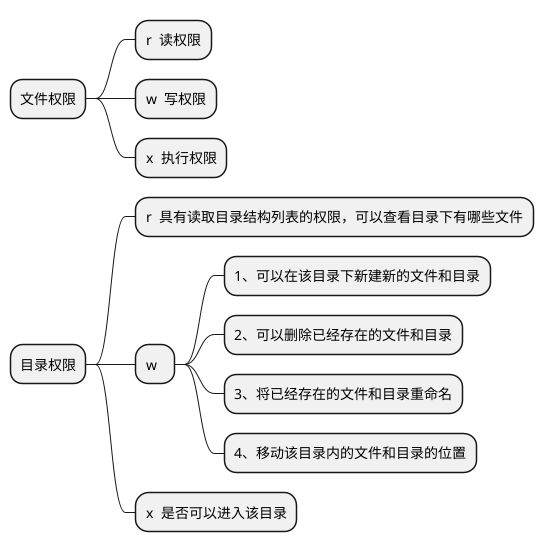

## 文件权限

|文件类型|使用权限|硬连接个数|所属者|所属组|大小|修改文件时间|文件名|
|----|----|----|----|----|----|----|----|
|-|rwxr-xr-x|1|lzq|root|78|4月  22 22:04|myshell.sh|



---

## 默认权限

### 默认权限掩码-umask

&emsp;&emsp;使用`umask`可以查看默认权限掩码

```shell

lzq@lzq-PC:~$ umask
0022

```

&emsp;&emsp;其中第一个0表示特殊权限，后面三位表示被遮盖掉的权限,0表示所有者的权限是rwx,2表示所属组的权限r-x,2表示其他人的权限r-x。

&emsp;&emsp;【注意】默认创建`文件的权限`，都没有x权限,但是`目录`是有x权限的。如下创建一个新的文件，其默认权限。

```shell

#虽然umask是002 但是文件默认是没有x权限的

lzq@lzq-PC:~/Desktop$ ls -l 1.txt 
-rw-r--r-- 1 lzq lzq 0 4月  22 23:13 1.txt  

lzq@lzq-PC:~/Desktop$ umask 
0022

```

---

## 文件的特殊权限 SUID SGID SBIT

&emsp;&emsp;当s出现在拥有者的x权限位置时，表示调用者会暂时获取文件拥有者的权限，这个状态称为Set UID,SUID。SUID仅对可执行文件有效,如下是对有执行权限和没有执行权限的文件进行Set UID。

```shell

lzq@lzq-PC:~/Desktop$ ls -l 1.txt 
-rwx------ 1 lzq lzq 0 4月  23 21:39 1.txt
lzq@lzq-PC:~/Desktop$ ls -l 2.txt 
-rw------- 1 lzq lzq 0 4月  23 21:40 2.txt

lzq@lzq-PC:~/Desktop$ sudo chmod +s 1.txt  2.txt    #Set UID

lzq@lzq-PC:~/Desktop$ ls -l 1.txt 
-rws--S--- 1 lzq lzq 0 4月  23 21:39 1.txt    #1.txt原本是有可执行权限的，Set UID后权限中的s是小写
lzq@lzq-PC:~/Desktop$ ls -l 2.txt 
-rwS--S--- 1 lzq lzq 0 4月  23 21:40 2.txt    #2.txt原本是没有可执行权限的，Set UID后权限中的s是大写，其实这种SUID权限也没有用

```

&emsp;&emsp;当s出现在所属组的x权限位置时，表示所属组有SGID的权限(Set GID)。
(1) 既可以用于目录，也可以用于文件，**用于文件**和SUID一样。

(2) **用于目录**，父目录有SGID权限，所有的子目录都会递归继承。

(3) 当一个目录被赋予SGID权限后，进入此目录的普通用户，其有效所属组会变为该目录的所属组，使得用户在创建文件(或目录)时，该文件(或目录)的所属组将不再是用户的所属组，而使用的是目录的所属组。也就是说，只有当普通用户对具有SGID权限的目录有rwx权限时，SGID的功能才能完全发挥。比如说，如果用户对该目录仅有rx权限，则用户进入此目录后，虽然其有效所属组变为此目录的所属组，但由于没有w权限，用户无法在目录中创建文件或目录，SGID权限也就无法发挥它的作用。


&emsp;&emsp;当t出现在其他人的x权限位置时，表示其他人有SBIT的权限(Sticky Bit)。SBIT**只针对目录有效**，对目录的作用是:只有文件的拥有者和root才能删除，修改该目录下的文件/目录。在不使用root时，user1无法删除user2在/tmp目录下创建的文件


