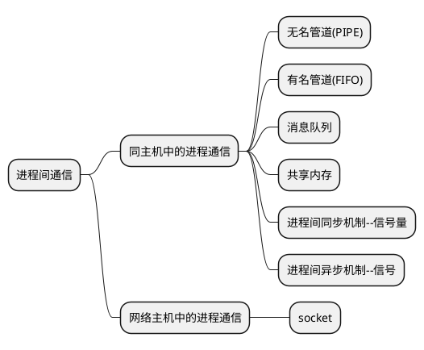

## 脑图



### System V IPC机制

&emsp;&emsp;可以使用`ipsc`命令查看当前使用的IPC工具，如果要删除某个IPC机制，可以使用ipcrm

```shell
    [lzq@fedora ~]$ ipcs

    --------- 消息队列 -----------
    键        msqid      拥有者  权限     已用字节数 消息      

    ------------ 共享内存段 --------------
    键        shmid      拥有者  权限     字节     连接数  状态      
    0x00000000 26         lzq        600        524288     2          目标       
    0x00000000 36         lzq        600        524288     2          目标       

    --------- 信号量数组 -----------
    键        semid      拥有者  权限     nsems     
```

