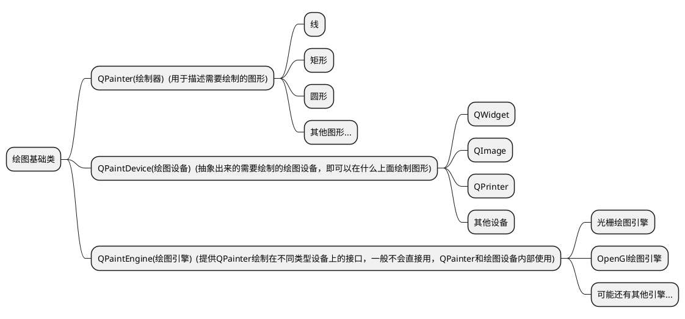
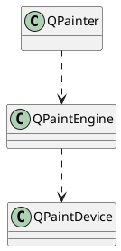
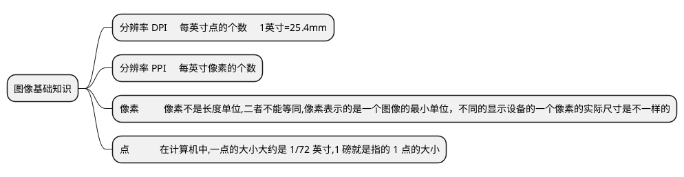
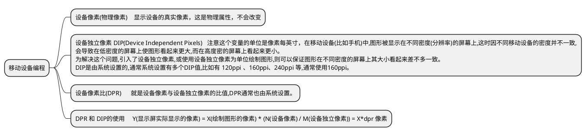
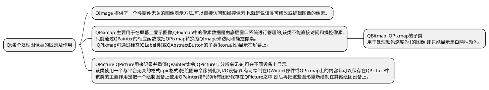

### **2D绘图基础**

&emsp;&emsp;首先介绍一下2D绘图会用到的主要类


&emsp;&emsp;这三个类的调用关系如下,这里用uml描述一下，绘制器通过绘制引擎提供不同绘制设备的绘制接口绘制形状


### **QLine 和 QLineF**  

&emsp;&emsp;QLine是线段图形的整形版本，所以对应的方法比较少，QLineF是线段图形的浮点数版本，精度更高，功能更多
&emsp;&emsp;其他形状类可能也是如此  

```c++
    QPainter painter;
    painter.begin(this);
    painter.drawLine(QPoint(11,11),QPoint(20,20));

    QPoint p1(11,50);
    QPoint p2(111,50);
    QPoint p3(11,60);
    QPoint p4(111,60);
    QPoint p[]={p1,p2,p3,p4};
    painter.drawLines(p,2);

    QLineF n1(11.1,100.1,111.1,100.1);
    QLineF n2(11.1,120.1,111.1,120.1);
    QVector<QLineF> v1; v1.append(n1); v1.append(n2);
    painter.drawLines(v1);

    painter.end();

    /*
        //创建 pr 对象,并立即开始在部件 this 上绘制图形。
        QPainter pr(this);
        //绘制一条从点(11,11)到点(111,111)的直线
        pr.drawLine(QPoint(11,11), QPoint(111,111));
        //函数结束时,在 QPainter 的析构函数中调用 end()函数结束绘制。
    */
```

### **绘制椭圆、弧、弦、扇形、圆角矩形**  

&emsp;&emsp;这里大概的写一下函数名，方便以后的查阅。椭圆、弧、线、扇形，传入的参数都是一致的，都是由椭圆演化出来的，这里要注意开始角度参数startAngle和结束角度spanAngle参数，都是相对于椭圆3点方向的x轴而言。
&emsp;&emsp;多边形和凸多边形是有区别的，多边形的线可以相交，另外一个不行。

|形状|QPainter的函数|
|----|----|
|椭圆(圆)|drawEllipse|
|弧|drawArc|
|弦|drawChord|
|扇形|drawPie|
|圆角矩形|drawRoundedRect|
|点|drawPoint  drawPoints|
|凸多边形|drawConvexPolygon|
|多段线(折线)|drawPolyline|
|多边形|drawPolygon|

```c++

    //弧
    QRectF rectangle(200,200,200,100);
    painter.drawRect(rectangle);
    int startAngle = 0;
    int spanAngle = 180 * 16;
    painter.drawArc(rectangle, startAngle, spanAngle);

    //扇形
    rectangle.setRect(200,350,200,100);
    painter.drawRect(rectangle);
    startAngle = 60 * 16;
    spanAngle = 30 * 16;
    painter.drawPie(rectangle, startAngle, spanAngle);

    //弦
    rectangle.setRect(200,500,200,100);
    painter.drawRect(rectangle);
    startAngle = 0 * 16;
    spanAngle = 120 * 16;
    painter.drawChord(rectangle, startAngle, spanAngle);


    //多边形
    QPointF p5[] = {QPointF(500,500), QPointF(600,500), QPointF(515,550), QPointF(550,465),QPointF(585,550) };
    painter.drawPolygon(p5, 5);

    //折线
    QPointF p6[] = {QPointF(700,700), QPointF(800,700), QPointF(715,750), QPointF(750,665),QPointF(785,750) };
    painter.drawPolyline(p6, 5);

    //凸多边形
    QPointF p7[] = {QPointF(700,700), QPointF(750,665), QPointF(800,700), QPointF(785,750),QPointF(715,750) };
    painter.drawConvexPolygon(p7, 5);
```

### **QPainterPath 路径**

&emsp;&emsp;QPainterPath类是一个容器，可把图形形状保存其中，需要时可再次使用,也就是说,**复杂的图形只需要使用路径创建一次,然后就可以调用 QPainter::drawPath()函数多次绘制它们**。一个路径就是由多个矩形、椭圆、线条等图形组成的对象,路径可以是封闭的也可以是非封闭的。  

&emsp;&emsp;QPainterPath对象可用于填充、轮廓和裁剪,也就是说即使绘制的路径不是封闭的,也会被视为是隐式关闭的。比如一个矩形只画了三条边但是也可以在内部填充颜色，和四个边的矩形是一样的。

&emsp;&emsp;这里说一下几个需要注意的点，设置路径之初需要设置路径起始点，要使用moveTo函数，设置的路径中可以有多个路径，每个完整连接的路径可以叫做子路径，使用moveTo会隐式的创建一个新的子路径，两个子路径是不会有上面描述的路径隐式关闭的。如下如所示，路径1围成的三角形进行了填充，但是路径1和路径2是两个子路径所以它们组成的矩形没有完成填充。
```c++
    QPainterPath ph;
    QBrush bs(QColor(1,188,1));
    painter.setBrush(bs);

    ph.moveTo(QPointF(500,600));
    ph.lineTo(QPointF(500,500));
    ph.lineTo(QPointF(600,500));
    ph.moveTo(QPointF(600,500));  //产生了第二个子路径
    ph.lineTo(QPointF(600,600));

    painter.drawPath(ph);
```

![avatar][多子路径]


&emsp;&emsp;currentPosition()函数获取当前点的位置，使用lineTo()函数等函数绘制图形后,会更新当前点的位置,具体更新规则依使用的函数而不同。
&emsp;&emsp;路径应该在类似构造函数的函数中创建，在paintEvent中被使用，主要是防止路径被重复被创建，导致绘制图形越来越多越复杂。


### **绘制文本**
&emsp;&emsp;这里列出常见的函数，具体参数使用时再看
|函数|介绍|
|----|----|
|drawText|在给定点position处绘制文本。函数不会处理"\n"字符,也不会自动换行,传入QPoint参数的y坐标为显示文字时的基线。绘制文本抗锯齿。|
|drawStaticText|绘制静态文本,以上函数的顶部对齐 y 坐标,静态文本是为了提高绘制时的性能而使用的文本|
|drawText|把文本 text 绘制在给定的矩形 rectangle|


### **QPen**

&emsp;&emsp;定义了怎样绘制线条的形状和轮廓,还定义了文本的颜色。画笔决定了线条的粗细、颜色、样式(即线条的虚实)等属性。
&emsp;&emsp;端点样式(Qt::PenCapStyle 枚举)
&emsp;&emsp;折线线条拐点连接方式  联接样式(Qt::PenJoinStyle)枚举


### **QBrush 笔刷**


### **QGradient 渐变**

* 线性渐变  QLinearGradient
* 辐射渐变  QRadialGradient
* 圆锥渐变  QConicalGradient

&emsp;&emsp;渐变颜色需要使用停止点和颜色两个属性来指定,可使用 QGradient::setColorAt()函数来设置单个的停止点和颜色,还可使用 QGradient::setStops()来一次定义多个<停止点,颜色>对,setStops()函数需要使用 QGradientStop 类型的参数。**注:停止点使用的是 0~1 之间的数值来表示的,0 表示起点,1 表示终点。**

&emsp;&emsp;渐变色的传播方式，渐变色的传播是指在渐变区域以外的区域渐变色是怎样进行扩散的。可使用QGradient::setSpread()函数进行设置,其传播方式使用枚举 **QGradient::Spread**进行描述。注:传播方式仅对线性渐变和辐射渐变有作用,因为这两种类型的渐变是有边界的,而锥形渐变其渐变范围是 0~360 度的圆,因此没有渐变边界,所以**传播方式不适用于锥形渐变。**

&emsp;&emsp;坐标模式,就是指的怎样指定渐变色的坐标,我的理解就是**定义渐变颜色开始点**和**定义渐变颜色结束点**的模式，

|枚举|值|说明|
|----|----|----|
|QGradient::LogicalMode|0|渐变的坐标与对象坐标相同,默认值    **这个我没有理解以后用到或者明白了再补充**|
|QGradient::StretchToDeviceMode|1|设备边界模式。渐变坐标位于绘制设备的边界矩形内,左上角为(0,0),右下角为(1,1),开始点和结束点是会随着设备大小而动态变化，保证看到整个渐变效果。这里的设备就是图形被画在的**窗口界面**上。|
|QGradient::ObjectBoundingMode|2|对象边界模式。渐变坐标位于对象的边界矩形内,左上角为(0,0),右下角为(1,1),开始点和结束点被固定到填充的控件上。|


### **填充**


### **裁剪区域 (QRegion类)**


### **坐标转换**

&emsp;&emsp;这个部分是描述，QPainter 在绘制图形时，对图形做的坐标转换，效果相当于PS中的变形。默认情况下,QPainter 是在自已所关联的绘制设备的坐标系(通常为像素)上运行的,绘制设备默认坐标系的原点位于左上角,X 轴向右增长,Y 轴向下增长。

&emsp;&emsp;参考qt帮助手册和程序运行的结果看，这些**变化坐标的函数是指改变坐标系(拉伸 旋转 平移)**，而图形以坐标系为参考为绘制，所以也会改变。
&emsp;&emsp;下面这段代码中变换2和变换4仅仅是 拉伸和旋转的调用顺序变换而已，却得到了两个不同的效果，这个涉及到图形计算，以后再研究。


![avatar][坐标转换]

```c++     
QPainter painter2;
    painter2.begin(this);

    //设置笔刷
    QBrush bstrnas(QColor(255,255,1));
    painter2.setBrush(bstrnas);

    //绘制矩形
    QRectF r(0,11,22,55);
    painter2.drawRect(r);      //变换 0:坐标原点(0,0)


    painter2.translate(50,10); //平移
    painter2.drawRect(r);      //绘制矩形  坐标原点(50,10)


    painter2.save(); //保存状态


    //变换 2:
    painter2.translate(50,50); //平移,缩放(Y 向 2 倍),旋转(逆时针)
    painter2.scale(1,2);
    painter2.rotate(-60);
    painter2.drawRect(r);      //坐标原点(100,60)


    painter2.restore();        //恢复状态,此时坐标系位于(50,10)处

    //变换 3:
    painter2.translate(100,0); //平移
    painter2.drawRect(r);      //坐标原点(150,10)

    //变换 4:
    painter2.translate(50,0);  //平移,旋转(逆时针),缩放(Y 向 2 倍)
    painter2.rotate(-60);
    painter2.scale(1,2);
    painter2.drawRect(r);      //坐标原点(200,10)


    //重置为初始状态
    painter2.resetTransform();


    //变换 5:
    painter2.translate(200,50);
    painter2.drawRect(r); //坐标原点(200,50);

    painter2.end();
```


#### 使用变换矩阵(QTransform 类)进行坐标变换

#### 窗口视口变换原理及其使用

<br/>

<br/>


### **绘制图像**

#### 图像基础知识






#### 绘图基础知识

&emsp;&emsp;Qt 提供了4个类来处理图像:QImage、QPixmap、QBitmap、QPicture,为了对这几个类加以区分,分别称 QImage为图像、QPixmap为像素图、QBitmap为位图、QPicture为图片。



<br/>

&emsp;&emsp;通常,可以使用**QImage类来加载并操作图像数据**,然后把QImage对象转换为QPixmap再显示到屏幕上,若不需对图像进行操作,也可直接使用QPixmap来加载并显示图像。
&emsp;&emsp;QImage、QPixmap、QBitmap、QPicture都是QPaintDevice类的子类(直接或间接),因此他们都是绘制设备,可以直接在其上进行图形绘制。


[坐标转换]:data:image/png;base64,iVBORw0KGgoAAAANSUhEUgAAAY8AAAD0CAIAAADsaj0GAAAACXBIWXMAAA7EAAAOxAGVKw4bAAAgAElEQVR4nO3deVxU1f8/8Pe9M8M2gA7KIsgeIgoaaiKiuOS+oQSWpX7zZ2ibidZHrYefPlqftEzL0hbT8lOmiKJIouZHS/uQioIELokbmkKyCMPObPee3x9Xx2FmGFlmu8P7mQ8bzr1z77mIL889c+45lEKhIISABvWX3AvN37kXhnfQ+xatHXS36j3CY7VyN4SQDRDqDRHDCaX3td73Go4tvTnVkZLHwnRDiL+Eml/oDRrdrDHQmFIzcEzQSQ2jtLPasTNCiEcepFUrc0pvOcuy0EIeGb5V5N6odwetPQ2XtFSIELIlQjAYVS3lFACwLGs419Q76G4yXU+WFkwxhGyG0HBU6Q0XAzmluUldbrg/y/BNot4SXa1MJQwvhPirWdvKcFpBCznVUnip7xD1trAMN690vzRiZiGE+EioGx+aLzQjSW+h1ru0EqqlJhv39ta0rVoKrJaCCQMLIVv1oG1loGEFD1NJM1a0SvQeQffImkfT2hNaSDFoYzBhWiFkq4S64aL7QjN0tBpZupv0vktv80r3w0S9Dau2Nq8QQjap2Z1gSw0o3X00M0sdUvCwu8pA2EHzzNIaxADNG1y6eWRgU0uFbdoBIWS1mt0JGogqzQxSR5XmGAXN/XVpngV02lZEX8MKHte20t2z9eUIId7Rk1bQclQZzimtrZoNKN22lW4bSjPUNKuodze9OyCEbJhQK5hAJ020wohlWZZlVSpVVVVVbknu7erbcb3iuDfqNq+kTdJjN4/F9Y4TUg9i8fD1wxHuEd4u3roNLvXZW3phuFxvSVt3QAhZLaq2tlYrqliWPVB44PC1ww5CB8ISePgf9z/CEnmN4n5uteyeimlkDR8dIYSMpVlaqe/aFIyiQdngInTRbCgtP7Z8iM+QScGTNn+55WTWKUvXHCHUudCEkNvVtyUfSvZd2acOJiEldBG6HLp2SH0PyDAMEACA+/fv51+8ZOlqI4Q6HZoQsuviLld710nBkzS7qAghLnYu7/32HtdRxe3NxVZ1dY1lK40Q6oRoQsjui7vjw+JFtEir5zvGN6ZeVv/luS+B60FnCWGxlxohZBnC3+/+/lf1X7PCZ2l1XQEAy7KvPPXKyP+MfCbsGTcHN8I++mRQk0Ag8PX17SqRUBT12PMRQqql0rt37zIMY4rrQQjZKuHOCztDuoVEekaCTlQRQnq69AzsEihXyVmWJUA07wrVfH19Fy9JtrOza+UpFQrFZ59uvH37tlEvBCFk4+ifCn+a1XcWNH+MhmEYdR/WtqnbPJ08CSHcaAbdtOoqkbQ+qgDAzs6uq0RixGtACHUGQrlKntgnUXOU5rd/fFtUWcSN53wQTwQIS/Lv5ZfWlWaz2VqHUN8AVlVWXigooGk6KDjIp6ev5o0hwzA3rl/r6esnFos134IQQq0kHBkw0svZi2tJcb9P7zW9Xl7vbOf8YOAC19RiWGmjNNIzsr9L/1X71uk9VleJJD/vfGFhobe39yuvL3L38FBvunTx4p07f/UK7W2my0II2ZBdP3z38Sef0c+FP6f1uIyrnau3i7ezyNnFzsXV3lUsFIuFYhd7FyEltKPtxCJxS0ekaTpuRrynh0dpaemxwwcF9y45Vt+0aywr+7v45rXCYcOGm/PyEELWZtOnH+ec/i20V4hm4ZRJE3JO/7b49VcNvPHLLVtv3LxJT3piklZawcMuds2nkRmG4YYv6PZbaeojqH2hfw+hQJCX98f5UycUYq96BZv1639HDO7bw1mBt38IdXI3i27FTZ2sWTJ92pQbN4sMv+v3U2fq6upprWFWWk8mc93tj2b7ZElLIw8opcIl92CX3AO9hk8YOny4UsXsPlNU9FfxiTP5gaERbr5hLG3vrCyiiNJIV40Q4p9jv/w6ftwY9edyAQH+7u7dL2g8HvN/c55P2/3j0UMH9qbsiB4ymCv8aX/q4KcG0roNK6LjwbwLjIphmZbaVnbFV7r+9mN1VAL0CBk/caKnl1djk+zI0WMKpbJ/ZCQlECqEEgAQye+Z9puBELJiJSV/37p1++lRI7gvp0+d/FPmYZqm1TsUXLi04JVF4ydPT9t/YPmbSzTfS5Pms0pp3gxqNqwIIUpGqXe8FcfpyimgBTLfCKAoicRt+IgRPby9b9++XV9Xq95HIezmxJYoldi8QqiTomj6wE+Z06ZOBgCRSDRh/NiDmUc0BwnkF1yokkoB4PfTZ7y9e2i+V6jbjNIcI6pZIlfKlaoWg4aigFbJKEUTK3IoLy+/e+fOwEGDjh45crHgQq/Q0MgBA2mapkEpoBiGYQjOM4VQZ3X815NvJi/y8fHuE9b7ypWr5RUV6k0CgeDFuS9ER0UJhQKhUKg11OnR3KHQfOI99Q2g+stGZaNcJW8paBp7DXa+ctK14HBp2NhjPx+JjhkWGBRUfPfu5cuXjx454tOzp5dXj66KK9XgKRAIsLsdoU5LJpMd++XEtMkTI8LDU/fu09w094VZo0bEvrHkH1VSaYC/396UHZpbW+y3Ut/0qbvbE8MSxwSNaamXXebfTxo72/XiEfnBz3p7uQYG+NM0PXnqtJ49e9ZUS/N/O+hW85ucsWsQ+gsEAsDRoQh1Ygd+ynwmfnpAgN/vp89olkvcJHfu3K2SSimKmjxxgta7tNdq1ptZXNsqyieKYZh6Uq///EK7uoFTLpdVeZRkz3BtUFyskXft6eroMn9Yd+ndEjl1NeeSk3/UszQt0OxRQwh1Qn9eKayouJ916rRW62d3atoH772btvvH2travfvS6+qapQ1VUlLCdSRxv3PZxPWvMwyj3qRWXl6+5uONmoeIHDDgpaSXAKCpqWnXjzsGR0V1F9t3VZY7QZPAXqS06/L7lXuXr/0lEgkTn53l4uJCUdS2rdv+yMszwzcFIWQztHvZic6QK1aDuuWliSukKEokEo2fOJEwLBEK65wljQKhUCQUCoUDhoT2H8zSNO3g4EBRlN6DIISQYY9WP+W+1goseLjIjXpuBt1DSKuq6uvr7e3tKQq6d3evq61VKpUEAChu5QkiEApFNE1RQAirUCjkcrm0qsp8l4gQsgnN1hPUXOpdtz2lvlXUOsTdu3e/3PyFaxcX7uNGwhKGZYECiqJooNT/cQghtTV1xcXFZrxGhJAtEGrdl2m2rUBfX7tuWrEse+fOHbPWGiHU+TQbwaA1akGzwaW59KmFq4wQ6pQeDCbQ7WsnOmNE79bcVTJK7CBHCFnEo7YVNF/nXd17pS7feWHniuMrcPUHhJBFaI9l1/xAsEnZlJCakF2czX3pKHAcFzQOJylGCFkEDQB3a+6Gbgo9dP0QNB/XXiQtUjCKCPcI8nDsKAUU3gkihCxCCAD7ruxzsXcZHTBas6+dEHK+5PyEJyY4CB24uz9CCGEJy7K/Hs20dLURQp0OzTDMgSsHJodMthfYQ/Ouq9N3T48PHv9oQAMBbFgh3pHgcnC2gs4uzi6uLZ7ee7pWX3tlQ2WToum/1/+rYBSgcYeIIxgQ70gkEswsG0Dv+3NfkCSon0c/0IgkADhy48icfnOifaP/8d9/NCgatD4rRIgXuJAihCKEwsziO/rnGz/Hh8VrfiYIAISQKxVXhvoODese9oTkiQ/+9wHXaaXeASHrp5VNhFC6hYhHaIVKMa3XNGj+aeDZ4rOjAkZxnwDO6D0jpzjnfuN9AAACDIvjrRCfcCGlfo2NLP6iY/xi3J3coflw9nMl50b4j+AKPcWeowJGSewl3Kbsu9oryyNkhQzkEWYWTwnjw+KhecPqRtWNqb2mqm/6WJZ9a+hb6kEMQZIgy9YYodbTbFjp3URREgCQSqXmqxNqL+HowNGaPVYAECwJZlm2qqFKCEL12qgAAASAgIezh8Uqi1DrqDvXH7snIRRFEYlEgoFl/YT2Anv1o3+aN4M3qm6kXUpzEbmwDEtYwjJsYUXhX9K/zjPnn3vuOctWGiEjwkYWXzSbO5RozCAa6RUZ0T2CZVmlUskwjEql2pKzJbhrcJhTmCXri9DjtL5hpQkzy/o1W/MG9MXWoxLyoMQofZP4A4FMoYM/nJhZ1uxR20rvi2aDsIAQVp1iHZqJgaJw0BYyoQ7+fGJnlnV61LZSv9j3577Td05L7CWEIYQljIoBAoQl92ruVdRV/CH/w5L1RahlRhyRgI0sKyTUiipCSHxYfFyvOJVKxS0gyPVbcV1XKpXq/v37Z+CMwWMiZEkdbFjpHgozy0o8WvMGmo+6Ap3eK3xOEFmz9nWutwZmlpV4tMi7ViMLdEIK0wpZLTOMSsfHDC1Ou9/K0GeCGFXIupmiYaV7fGxkWYr2Ws1qmiVazSuErIqZ2zuYWZZCa35hoJEFmFbIupm6YaX3dHhjaE5C7n+6nVagL7wQsjam61x/LGxkmZn2CAY1vVFlzbGFI+xbz5a+V1KpVCKRUBSxSGABZpYZCbW+1sojXuSUGo6wbz1b+l5xGcHlBWaWDWu2sry6tKV2lu4mhKzEw8yy5M8ndmaZVLO2lW6fOvayIx7BRpZtE+o2oww0rBCyfphZtqrZ6FC1loYvYHIhvsDMsj3NnrzRG1vY1EL8hZ1ZtkT7M0FoXVMLIb7ARpbN0JNW0HKHOt4MIp7CzLIBtOEAwnhCtkR9Y2jBe0NjrWbYp0+fixcvtmbPv//+28vLi3v9xhtvbNy4sSPnfSy9p5DJZBKJpKGhoSNH1j/eSgtmFrIZUqkUO7N4Snu8leFUwtgyJ5wX3HTwxtAUCCEsy5ru+LTeUhyvYCXw316T4tpZ/L0xzM3NHTJkiJ+f38svv6xUKrnCtLS0IUOG+Pv7T58+/fbt2206YElJSc+ePVUqFQAsXbo0KCiIC4FXX31106ZNAHDr1q34+PiAgIDBgwfv27ePe9eCBQuWLVsWFxcXGRl5+fJljUsjH374Ya9evcLDw/fs2dPWq9OlP600YWZZhPpnFwPL1Ph7Y5iWlnbgwIG8vLz8/HwuO3777beVK1du2bKlqKho/PjxL774Ypv+/vr4+HTv3j0/Px8ATp8+7erqeuXKFe51TEwMy7IvvPBCZGTktWvXNm3alJyc/McfD9aUyczM/Oqrr/Lz8yMiItRH279/f0pKyvHjx8+dO3f06NE2XZpej08r0JmGoeNnRa3B/asLGFimx9NGVnJyspeXV/fu3adOnVpQUAAA27dvX7hwYf/+/QUCwSuvvHLv3r1bt261qRoxMTGnTp2qrKxUKBTx8fGnTp0qKSmprKzs37//pUuXiouLV6xYYWdnFxUVlZiYqG4xJSYment7AwBFPbqtTktLS0pK8vPzc3JyWr58eZuqoZf+EQzIeuDadmbDu84s9Sd9YrG4rKwMAO7evXv27NmUlBT1PuXl5X5+fq2vQExMTHp6elBQUHR09LBhw3744YcuXbpERUUJBILS0lIvLy+RSMTt6efnx7XCAMDT01P3UKWlpf7+/tzrgICA1tehJZhWPICBZU68yyxNPj4+M2fOXLhwoWbh33//3fojxMTELF++PDAwMCYmZsiQIa+//rqrq+uwYcMAwMvLq7S0VKlUcoF1586dHj16cO/SbFKpeXl5VVRUcK/Ly8tbX4eW0ICf9FkfiURiqb8niMPTzqx58+Z9/vnneXl5hJC6urqMjIy2fkjn7+/fpUuXlJSUmJgYJycnHx+f9PT0mJgYAOjbt6+Pj8/HH3+sUChycnLS0tISEhIMHCo+Pn7Hjh0ymQwAvvrqqzZVQy/987Ija4MdWObHx86sUaNG/fvf/168eLGfn19UVNThw4f1tnoMi4mJcXV15W7ihg0bxjDMk08+CQACgeDHH3/MyckJCQl59dVX169fP3DgQAPHSUhIGDNmzKhRo2bMmNG7d++2VkMXdeHCBW4pZpZltZZlVr/QfH3//v3ly5d3fOZJo9/UdLw9YopatU9L18L9tel4JW3pe2UeFpz9Xc1Yf/r81ap+K6LB1BVCBv4VxQ4sS+F1Z5bNaNUIBmRmBv4+4C2hBfG0M8tm4GeC/IMtLAvCRpYFYVrxEgaWZWFmWQTeCVoXHLvAI+28MWwAyDRaHTrVjSGmFV91qh9Tq9WeUQ73ARYTkBmtDsaaMMv6YVrxGAaWlWhbZt0HKAJYZ+Q6dIbMwrSyIu34OcPAsh6tzaz7AACwlsBt49fBtjML08q6tKPTCgPLqjy+M4tLKxnAElONhLDVHwmLfSZond9Ki9Sq4x/o4EeEVuUxnxjef/jiAMDPABNMUgeb/MTQYmlliidvOn4Q/v65YmBZmxYzq0KjSfUGgYsU2JuqDjaWWXgnaC06PnbBVtv/vKanM+u+xubrAJ+YvA4205mFaYWQyTXrzLrffNu/CdwxRx1s4B8zTCubYgM/kbZK3cj6bV/zDY0Ab5rpwUO+N7IwrayCEX96MLCsmVQqHaY701MawHHz1YG/mYVpZS2M+MANBpY1o6uq9JQuIqAwazX4mFmYVrYJA8tKsSxVWamnvBDgM7NXhm8wrWwWBpYVomprgWH0b3uPQIl5K2PRibraAdPK8kw37wIGlrXR37Di1ENKTwvEB4/GYeFY9mass1bIZujvtHpoFsAoipwwy5RBfJzlHceyN2ORPzyTRiSPxrjz90+w9Qy1rQAA4Hjv3nZUodLSK1ZYJ7wTtDAztOZ4dD/IfVDV7l+Wrv7jPTatBIWFNWvWmHplMD42rADTyhqY4a8ZjwLLtlH37z92H4e1a+nyctOtZsi7znU1TKvOAgPLGhjut+JQdXX2n37KvTbdKju8a1gBriLRqaj7sCxdkc7LwJ0g06sXM2SIasgQ1ZAhbECAuty4K1bwt2EF7U4rXl+z9TD/mhFcYJnzjEhTs7QSiVRPPim8fBkaG+tOnmT69zfwRuNmFh8bVtC+tOLppSJkeSqVcuxYJjpaNWQIExlJHBzEc+eKDh4UXL1qOK04Hcwsnnauq+GdYKeDzSsLatizB6hmKaOKihIdPCjIzoaZM1t5EKlUKpFIKIq0KbBs4A8d08pisP+oM6K080UVFQUAwrNn23SYdjey+NuwAkwry+LFECFkUkz//sTRUVBYSNXUkC5d2vTe1meWDTSsAEcwWJZt/AyhDhGJmIEDgWWF58617wCtH5nF64YVYFpZkOmG0iB+4W4GBdnZHTmIgR8nvneuq2FaWRIGFgIAZsgQaHvX1fDhwyUacnNzpVJpRUWF4UbW9OnT/fz8ZLJ2Lmyve9KWCk0B08rCMLCQ6qmnQCAQ5OWBUtmmN27cuPHeQwMHDgSAffv2hYSEXL16VZ1Zmg2rkpKSrKwsoVB46NChdtdW96QtFRqd/l72//31v99v/y6iRCzDEoawDEtYwr2W1ckWwAIT1QahToh06cL07i24fFlQUMAMGtT6N4pEIgcHB80SpVLp7u7u4eGhHuWguTU1NTUyMjImJiYlJeWZZ57hCjMzM9euXfvXX3+5ubm99tprCxcuBACVSjVv3rzs7GylUjlo0KBPPvnEz8+vpZO2VGh0+tNqqN/Qfu79HAWOKpVKpVIplUqGYb7N/TbEPSTYN9jUdWo3nrZQ2jd8poN4+r2yVaqoKMHly8Ls7Dalla6YmJjFixdv2rRp0aJFuh1Vu3fvnj9/fkxMzBdffFFaWurl5QUAzs7O3333XUhISEFBwYwZMwYOHDho0CBCyKRJk77++muBQLB8+fI333xz7969HamYUdAAUFJX8tQ3Tx0rOqYuFVJCZzvn03dPW65ibSY1BgtWHsyYIIZnXLHy75VNal/X1bJly4KDg4ODg8eOHQsAjY2NiYmJ69at27Fjx9atW7l94uLizp8/DwC5ublFRUUzZswIDw8PCQnZs2cPt8PIkSNDQ0Npmo6MjJw2bVp2djYAiESiWbNmicViBweH5cuXnzlzpqWTGig0OiEA/HT1J2d75xH+I4Bttk1sJ/5P/n9mh8823emRmkVaWFp4NHWfjWnfGNF33nln+vTpACAUCgEgIyNDLBbPnz9/woQJEydOFAqF8fHx+fn5ffv2BYBdu3aNGDHCw8MDABITE1NSUt544w0AOH/+/Jo1a65fv04IqampmT9/PgAwDLNmzZrMzMz6+nqaphsaGuRyub29ve5J9dbERISEkEPXDo0LHmcnsFOyzTr5+nv2/9+t/x0oPDA5eLLpaoDUMLA6LdbPj+3Rg753j755kw1ubWdL165dvb291V82NTW5ubkBgI+PT3p6+qRJk/bt2zdv3jwHBwe5XJ6enq5QKEJDQwFAoVBUV1cXFBT0799/3rx5b7/99syZMwUCQXJyMneo1NTUEydOZGZmuru7l5aWhoWFEUL0ntRAodHROfdySupKpvaaqndzfFj87ku7a+Q1pq4H4ljDR4Q4E5ZFMNHRACDswKirp59+Oi8v79ixYwAQFBQ0c+bMU6dOBQYGAsCRI0dYls3Ozs7KysrKyjp79uzw4cNTUlIAoK6urk+fPgKBoLi4WP1ZYW1traenp7u7OwBs2bKl41dnFHRGYUZA14Bwj3C9mz3Fnj1ceqhYlZmr1ZlhYHVO7bsZ1OTv75+amrphw4ahQ4fGxsY2NDR8//3377777tGjR1NSUmbNmuXr6+vxUFJSUlpamlKp3LBhQ1JSUlxc3OrVq8eMGcMdavbs2SzLxsbGJiQk9OzZ0zhX2GGU4xuOSZFJcyPmsizLffbHMAz3USD34u+avyV2kgefCUpCgh2CFyzAEQymxcWEZZ8iNP8A6I7P9kVRhL83sIKCApeRI5mQkLr2PoJj84RylXxKyBTNov2F+4ulxTShWZblxlgxKoaw5Ib0RmVjZSFTiOOtTA07sDohJjycODsLbtygKitJt26Wro41Ekb7RruL3RmN9WPHBo6t61FnT9k/aGQxKpVSxTBMXVNdcNfgAPsAy9W2E8HA6nQEAmbQIOHJk8Jz55QTJ1q6NtaIjusdp1XkYu/iIfYQ24kf/BKJnUROTiInIS20E9g5Ch0tUtFOCDuwOhsVN+qqY4832zB6VMAoS9cBtQgDq1Np92QMq1ev/uc//6lVKJPJJBJJQ0NDa3bmBdpeYG/pOiBDrCewkKkxTz0FQqGwoADaO0dCm8hkshkzZoSEhPTo0SM2NpYb+gAA27Zti42N9fb2joiI+Pjjj9UjrbZu3TpixAh3d3duWCknPz9/zJgxfn5+fn5+CQkJN27cUB/E6BVuwxwMDGEevxMyAWsILMDmlekRsZjp2xfkcmF+vhlOxw0HzcrKunz5cnJy8pw5c6qqqgCgtLR01apV+fn5W7Zs+eabb3bu3Mnt7+XltWLFioSEBM2DeHp6rlu3Li8vLycnJywsjHsomjuI0SvctrRiCfv4/ZAJWENgYV+7GXBdV625Gbx+/frYsWN9fX0TExOrq6u5QkLIhx9+2KtXr/DwcPWTgC3tLBKJRowY4eXl5ebmFhISolQq7927BwArV64cPXq0h4fH0KFDp02bpp6vaurUqRMnTuzatatmNXr06DFgwIDu3bt7enr6+fkVFRVx5StXruzo90JHG9JKwSiweYWQST0YI/q4tGJZdvbs2ePHj79169Zrr73GjUoHgP3796ekpBw/fvzcuXNHjx41vDNn+vTpQUFBsbGx48aN69Onj+YmQkhubq5Woa66urrQ0NCePXuuWLFiyZIlbbreNmnDI4hyRo6D2i3IGsY0IFNjhgwBihLm5AAhugvkqF28eLGsrCw5OVkoFI4cOXL06NFceVpaWlJSEjcX1fLlyw8fPmxgZ853331XU1OTmZkpEomo5mdcu3YtIWTu3LmG6+zs7JyVlVVRUbFr166IiIj2XXhrtKFtNTZo7GCfwaarCnqstt0P3gP4wDjn5fUYcX5he/RgfX2pqirBtWsGdistLfXx8VFPeBDwcCX60tJSf39/3UK9O3Pc3NwCAwMXLVr0ww8/nDp1Sl2+efPm9PT0tLS0x06zR1GUh4dH3759ly5dOnfuXN1PIY2lDWkV4RGBg60srlWBRQC2A/Qh0N1MtUJG1JpxDF5eXvfv31d/WV5eri6vqKjQLdS7sxZCyO3bt7nXW7Zs2bZtW0ZGBjfDTOvV19drnsu4cF52/nlMYN0CGEfg/xFQAswya8WQUTyYjMHg480RERFdunRJT08HgNu3b//8889ceXx8/I4dO7hFIr766ivDOxcUFGRkZJSVlZWXl69fv/7WrVtRUVEAsH379k8//XTv3r1ubm4ymUz5cLZ4lUolk8m4R4llMplKpQKAgwcPnj59WiqV3rx5c8mSJYGBgdx96Pbt243+ncHVT3lJfx8WA/AFwNsEGgEAYBaAqxHOZfGRE51NazraaZresWPHokWLvv76a09PT24mPABISEi4du3aqFGjvLy8Jk2aZHhngUCwefPmV199VSAQ9O7de+fOnU888QQAbNq0qaysbPDgB90+48aNS01NBYD169d/9NFHXOGuXbtef/31999/Xy6XJycn37lzx8XFJSoqas+ePVzn16ZNm+bNm2fc7wx14cIFLixbmoNBPS8797qyshLnYLASzaZquAIwn8AZjc3nKHjKCGcxW6dVJ5+D4RGW7RIURNXW1hYWsm28EbNteCfIf0qADwCebB5V/QE6tBwBshyaVj31FBDSwfVQbQ+mFY9JpdKBABfsCKwkoGi+bQEFOM6Bt9q3qITNw34rvqJkMoePPsoVCIDRGbLrCPCCkc5iG/dWfIOTMehlkrTCB8rapB1xIDx92umNN+ibN/Vvfg6gS0drhSyIGTgQ7OwEFy9STU3EEYcNPWCStMJ/jU2HqqtzWL3a/ttvDe20AG8C+Y04ODD9+glycwW5uarhwy1dHWuB/VZ8Ijp+3CU6+jFRFQ4QZZzT4dgFC+r4ohK2B9OKH6iqKqeXXxYnJtIlJYb3fOMSGLF/HZvJlvLYEe3Dhw+XaOBmSlCpVIsWLfL39w8ODl66dKnuu6ZPn+7n5ydr7/xZenx8pmoAABKJSURBVE+qt9AUsJedB+iyMufYWLqFByY0EXv7H+XyTfjkM/+poqIePN7MskDrb1Vs3Ljx2Wef5V5zCynv27fv7NmzOTk5Tk5OZ3XaZSUlJVlZWV26dDl06NAzzzzTvorpnrSlQqPDthUPsJ6eTZ9/TpydH7uncsYMY7WF8DbQsoiHBxsURNXWCv78s6V9RCKRw0PcCHKlUunu7u7h4eHs7Pz0009r7Z+amhoZGTlnzhzNSWMyMzNjYmJ69uzZr18/9UKnKpVqzpw5ISEhAQEBCQkJd+7cMXDSlgqNDtOKH5Tjx9f/8gsbFGR4N8WLLxpx3j68DbSsdnRdxcTEZGdnb9q0Se/W3bt3JyYmJiYmnjx5Uj23p7Oz83fffXfnzp3vv/9+7dq13H0cIWTSpEn5+fmFhYU+Pj5vvvlmh6/GCDCteIPp1avu+HHVyJEGdlANHgzWMdEo6rjHdl0tW7YsODg4ODh47NixANDY2JiYmLhu3bodO3Zs3bqV2ycuLu78+fMAkJubW1RUNGPGjPDw8JCQEPXMoiNHjgwNDaVpOjIyctq0adnZ2QAgEolmzZolFosdHByWL19+5syZlk5qoNDosN+KT4hE0vDtt64DB1IPJ6vVpHjxRfX8bTh1nw147Ij2d955h3tEmZu7KiMjQywWz58/f8KECRMnThQKhfHx8fn5+X379gWAXbt2jRgxgpsBJjExMSUlhVsM4vz582vWrLl+/TohpKamZv78+QDAMMyaNWsyMzPr6+tpmm5oaJDL5VyHlNZJ9dbERDCteIVlnRYupKqrWW9vurwcVBpTudrbKx52c3I6EljYLrMGTEgI6daNvnuXLilhfXx0d+jatau3t7f6y6amJjc3NwDw8fFJT0+fNGnSvn375s2b5+DgIJfL09PTFQpFaGgoACgUiurq6oKCgv79+8+bN+/tt9+eOXMmt6gEd6jU1NQTJ05kZma6u7uXlpaGhYWpV77ROqmBQqPDO0E+cVy1SnT8OOnWrf7w4frMTOLurt6kmDaNuLlp7d+RW0LstLI8iuJu7VvZdfX000/n5eVxC20FBQXNnDnz1KlTgYGBAHDkyBGWZbOzs7OysrKyss6ePTt8+HCur72urq5Pnz4CgaC4uPjQoUPcoWpraz09Pd3d3QFA3fVucZhWvGGXmmq/eTOIRA3/+Q/r76+Kiqr79VemXz9uq+LFF/W+C/uweK1N66H6+/unpqZu2LBh6NChsbGxDQ0N33///bvvvnv06NGUlJRZs2b5+vp6PJSUlJSWlqZUKjds2JCUlBQXF7d69eoxY8Zwh5o9ezbLsrGxsQkJCT179jThFbYFzm/FD4Lz552nTKFksqb16+Xz56vLqaYmp9deE1y6VHv2bEuLDjSbBqsVuGgzf9sK57fSJTx71nnCBKZfv7rffrN0XSwP+614gC4rE8+ZQ8lkinnzNKMKAIijY8O33wquXTOwPko7OrBs7O88f6mefJLY2wsuX6bq61sz4M624Z2g1ZPLxbNn0/fuqYYObXw4z2wzFMWEhho+Bt4P8pW9PRMZCQwjOHfO0lWxPEwra+eUnCzIzWX9/Bq+/x5EonYfBwOLp3BmPjVMK6tmv3mz3e7dxMmpYedO0r2j6221JrAs2/VDUaQjvyxVbZNqzYj21atX//Of/9QqlMlkEolEd3U/vTvzAqaV9RL+8ovjqlVA041ffsmEhxvlmNbcwpIag6UvwvhUgwcDTQtyc5sNrzMGmUw2Y8aMkJCQHj16xMbGckMfAGDbtm2xsbHe3t4REREff/yxeqTV1q1bR4wY4e7uzg0r5eTn548ZM8bPz8/Pzy8hIeHGjRuGD7J48eKBAwdKJBL1YHoDB9E6I6aVlaJv3BC/9BIwjOytt5RxcUY8sjUHFtJF3NyYkBCqoUFw6ZJxj8wNB83Kyrp8+XJycvKcOXOqqqoAoLS0dNWqVfn5+Vu2bPnmm2927tzJ7e/l5bVixYqEhATNg3h6eq5bty4vLy8nJycsLGzhwoVceUsH6dev38aNG3v16tWag2idEdPKGlG1teLnn6eqq5VTpshWrDD68VsKLIww68Tom6b9+vXrY8eO9fX1TUxMrH74JBYh5MMPP+zVq1d4eLhm40XvziKRaMSIEV5eXm5ubiEhIUql8t69ewCwcuXK0aNHe3h4DB06dNq0aer5qqZOnTpx4sSuXbtqVqNHjx4DBgzo3r27p6enn59fUVERV97SQebPnz98+HA7O7vWHETrjDgvu+Vp37+wrNNLLwmuX2f69Gn8+msDQxPMURlkBVRRUXbffy88e1b+8stcCcuys2fPTkxMPHLkyO+///7cc88lJSUBwP79+1NSUo4fP969e3euxMDOnOnTp1+4cEEqlU6YMKFPnz6a5yWE5ObmvvDCY5YkqaurGzRoUENDQ1NT07/+9S+trUY5CAfnZbc6jqtXi44dI926NezaRcRiE50FH3vmEd0R7RcvXiwrK0tOThYKhSNHjhw9ejRXnpaWlpSUxK3tvnz58sOHDxvYmfPdd9/V1NRkZmaKRCKtqanWrl1LCJk7d67h6jk7O2dlZVVUVOzatSsiIkJrq1EOwsHRodbFbs8e+02bQCRq2L6d9fc36bkwsPiCDQpiPTyAoqjKStKtGwCUlpb6+PioJzwICAjgXpSWlvo//LHRLNS7M8fNzc3NzW3RokVDhw6NiIiIiYnhyjdv3pyenn7o0CEHBwfD1aMoinuaZ+nSpU8++WRhYaH44b+yRjmIGvZbWRFBXp7j4sVASNOaNeZZ6USzA8v2HluxJXWnT9f++ScXVQDg5eV1//599dbyh7Nge3l5VVRU6Bbq3VkLIeT27dvc6y1btmzbti0jI8OjjUvb19fXq89llINowrSyFnRZmXj2bEomU7z4ovyll8x2XvyIkBfUOcWJiIjo0qVLeno6ANy+ffvnn3/myuPj43fs2MEtEvHVV18Z3rmgoCAjI6OsrKy8vHz9+vW3bt2KiooCgO3bt3/66ad79+51c3OTyWRKpZLbX6VSyWQy7lFimUymUqkA4ODBg6dPn5ZKpTdv3lyyZElgYCB3H9rSQRQKhUwmI4QolUqZTMayrIGDaJ0Rn2q2DnK585QpwtxcVXR0fUZGR8astw/3wQi2rXjk6tWrixYtoijK09PT1dVVIpG8//77hBBuFj0vL69JkyYtW7asuLhYLBbr3fnSpUtLliz5888/BQJB7969ly9fzk3lPmDAgFu3bqlPNG7cuNTUVAD48MMPP9J49uv1119///3309LS1q1bd+fOHRcXl6ioqFWrVj3xxBMGDjJlypRTp06py3fv3j1+/PiWDqJ1Rkwrq+D06qt2KSmsr2/dr792fMx6+0gkEkwrZM3wTtDy7L/4wi4lxViP17QbRhWycphWFvbg8RqKavziC6aFD24RQoBpZVn0zZvil14ClUr21lvK6dMtXR2ErBqmlcU8erxm8mTZ229bujoIWTtMKwthWaekJMG1a0xYWOOWLWZ+vAYhPsK0sgzH994T/fe/xM3NpI/XIGRLMK0swG7vXvvPP3/weE3zxyAQQi3BtDI3wR9/OL7xBhDS9MEHqthYS1cHId7AtDIrurz8weM1//d/co1ZOxBCj4VpZUZyudPs2fTff6uGDGlct87StUGIZzCtzMdp6VJhTg7bs2fDDz9A87kTEUKPhWllJvZffmm3a9eDx2vc3S1dHYT4B9PKHIS//ur4r38BRTVu3sz062fp6iDES5hWJkffvCmePx9UKtmbbypnzLB0dRDiK0wr06Lq6h48XjNpkuyddyxdHYR4DNPKtKjqaqBpfLwGoY7DVSRMi/X1rT92jKqpIc7Olq4LQvyGbSuTI87OrI+PpWuB+IGqqhLPn693k0t0NMhkACC4ckWcmGjeelkFbFshZGFUTY3zhAnqLwU3brgMGaLuN2jcvp0JCaErKymGoauqWHd3x2XLKKnUZfhw4u5ev3+/5qHsv/nG4YMPav76y6wXYC6YVghZGOnSpe7MGeHZs6onn3SNjq6uqHAdMKDuf/+jr11jBgwAALqkxOm116iSEseVKxVTp6qio2XvvOPw0Uesp6fmcQR//ik8fpw4OVnoOkwO7wQRsjxBQYHjkiVAHq2TRtXWOi1eLPrlFwBgfXzqDxxg/fwavvwSCBEdO+Y8bpz95s32O3e6REcDwwAAJZM5Ll3a9Mkn1MO1sGwPphVClsYwjsuWNX79NTg4EIkEAIhEwnp7N+zZ47BqFVVfr97R/scf6eJixcyZTRs2qMaMqTt2jGIYLuMc3nlH/sorbM+empFnY/BOECFLEwhk77/v+M47AEAcHZ2nTOF+B4CGH34gzs6UVOrwwQf0rVtUeTlxcwNCBFevsr6+6gOIDh+mAJRxcRa7BLPAtELI8lSRkYrnnxcdPNj02WdEIAAAuwMHRPv3c5FEnJ3ZsDDi7S1butQ5MZGqrKTv3aPq64XHjhGKcti8WXD2rODCBdd+/QCAqq527dfPggtTmg6mFUJWQCRSPP88sKzTK6/I3npL9NNPgosXG7ZvB6GQ2yqfP99u2zYAqD94kKqsdBk7VjF7NunWTZacrHWkLsHBtRcumP8KzKANaVXWUNZF1MV0VUGo06IaG+mbN8HREeRyp4ULKalU/tJLwvx8JjSU9fUFmgYAYFkAoMvKnObMaVq5UjVxovP48aBSyV9/nTg4WPgCzKINvewHrx785MwnxHb78BCyDJYVz51rv3UrVVratGFD7YULtZcvs336CE+ccFqyhL59m6qrcxk8mHh4gL29w6pV8rfeUsbHE0fH+owMwZ9/ivbs0TxYzc2blroOU6MuXLjAMAzDMCzLKpVK7rVKpVKpVI3yxlczX016Mqlvt74Mw2zP2+7v4h/qFLpgwQJLVxsh1OnQAFBSV/LUN08dKzqmte1O7R0lowxzD3u0N4UjHhBClkEDwE9Xf3K2dx7hP0Jr26XyS6MCR9kL7C1RMYQQaoYmhBy6dmhc8Dg7gfZM4TklOaMDR1ukWgghpIXOuZdTUlcytddUrQ3VsuomVdPJWyeVrM0O5EcI8QidUZgR0DUg3CNca8Ovt359tu+zg3wGvf/b+zKVzCKVQwghNfp40fFpodN0N1ytvBrlExXaLTSwa+BnZz8zf80QQkgTLVfJp4RM0So9f+/8cP/hFEUBwORek/NL86UyKbeJJay564gQQgB0tG+0u7jZ8naEkPN/nx/mO4z70kPsMcx3WFf7rtyXeffyzF1HhBACoON6az+3fav61sSQiZolrw1+jXo4k2FA1wDz1AwhhDQJRwWM0ioKkgSpVCppo1RABAIQaG3t7mRrD3YjhHhBaC+wZxhGd0NRVVFGYYZYICYMYRmWsORaxbXi6uICpmAB4JM3CCFza3EOhv5e/cPdw7kHBrnnB7fnbQ90DQxxDDFn/XiHqqpy+sc/Gr79VneTS3R03YkT4OAguHLF4d13G/buNX/1EOIvnN/KCDq+ZglVXe3w3nuiEydAKFSOGtX00Ue4VCpCWvApZSPg1ixp2rix7uRJSi6vrqigFIr6Y8cav/ii7swZpndvurTUacECbs0SUWamKjq67vfflVOmKKY9HOlG06phw2r/+KP29GlBfr7omPYT5gghPW2rjMKMM3fOdLXrSljCMqy636qstqyyvrJAjv1WenBrltT9+qu6hFuzRLZqlfLpp7k1S1yioxu+/FJ0+LDo2DHhyZOCK1fY3r3tt2yp+/134uqqjI8HABCJWF9fSiq12JUgZK30pFVc77jJT0xWqVTqia64fivudWVlpflrae1aXrNEPHOmKipKvay8/Y8/QmOjYuZM1bBhDp980rB9u+vgwZqLlNClpcL8/Kb16y1zIQhZMey3MoYOr1nCoRoanF58semDD7jIQwhpwrQyjg6uWSJLTqaamsTPP6+YN0+p0WGPEFLDtDKSjq1ZQslk4hdeUMyapXj2WcteB0JWC9PKODq4Zondf/4jzMoSXL7s+K9/AYBq6NCG7dste0UIWRtMK2NgWfHcuay3NxMa2rRhAxMaStXWio4eFZ44Yf/1143r1xN3d+ennyaeno/WLBk3DgDqMzKc3nxTtGeP/OWX5S+/bOnLQMiqGVrzpqXPBHHNG4SQ+eHoUIQQP2BaIYT4AdMKIcQPmFYIIX7AtEII8QOmFUKIHzCtEEL8gGmFEOIHTCuEED9gWiGE+AHTCiHED5hWCCF+wLRCCPEDphVCiB8wrRBC/IBphRDiB0wrhBA/YFohhPgB0wohxA+YVgghfsC0QgjxA6YVQogfMK0QQvyAq58iayGRSCxdBWTV/j9/BGKTp/7H5wAAAABJRU5ErkJggg==

[多子路径]:data:image/png;base64,iVBORw0KGgoAAAANSUhEUgAAAXYAAADyCAIAAADWanlIAAAACXBIWXMAAA7EAAAOxAGVKw4bAAATJklEQVR4nO3df3DT9f3A8dfnR9KkSaidArITxG5lHNYxBlbZqB4Ilju325gK50Cnvc1jG3oMN25TmLeBEzyGertD5jYRbujJhrsqU2dVqsAXS0FEqiegBwInUIoFmrZJk3w+3z8SC5RS2jTv/Pjk+TjOC8knn74C55PP55NP8tGam5sFANTQMz0AACcjMQAUIjEAFCIxABQiMQAUIjEAFCIxABQiMQAUIjEAFCIxABQiMQAUIjEAFCIxABQiMQAUIjEAFCIxABQiMQAUIjEAFCIxABQiMQAUIjEAFCIxABRyTmLMzZuNvXszPQWAc+RwYgaUlfmnTvVXVgbGjxcRz5Il2tGjXZZxbdhgbt6ciekAiOR0Yuzi4uBrrwWrq0VE37fPeO89z6JFgcmTA5Mnxxcw9u71LF4cKysz6+oCU6bEfxWNGFGwcuWXq7A9S5YUlZZm6iUAjmdmeoDU8D74oDV8eOv69QUrVkgsJiL6kSO+WbNan3pKCwaj113XUlMTv9N/yy0dt98ef5avqipWUiK2ncnRAUfTcveCswPKyuwhQ8S2pbW1ffly7eRJz6OP2l5va3W17fGIbeuHDxu7drnXrm19/nkRMbZv91VVhebN67j77vga9MOHrYEDi0aNOvXpp5l8JYBz5fCO0umGhvZFi2IlJS1bt1olJWZtrdi2fuyYe+VKLRgUTZNQyLtgQfvSpa5XXvHddlvhAw+E5851P/ecb+ZMo6FBRKwrrmATBlAqhxMTmDhRRMz6es/ixZ6HHrJGjmyprQ1WVxv797teflnfv98/Y4bt81nDhlmDBoXnzGnZuDFcVRV8/fXw7Nnidmd6fCAv5PKxmGhURGIjR3bceae5ZUvBihWu6moR0U6danvySS0YbF21qnDOHBGxhw4tnDVLFi7UDx2ySkut4uLWdesyPDyQH3I5MSIiYgcC4vFIR0f4/vs7pk8XkUBFhYjYfn9s9Oj4MtbgwS01Nca+fZ4FC1pfeCGT4wJ5JlcTY+zZox0/7lm61Ni5U4vFomPHutavT5wCY1mZng5AQq4mRjtyJDJtWnTSpGhFhe3xuNesid50U6SyUkQK7723y8K+6dP15mYJhfRDhwJTpohI27JliW0cj4e3kwB1cvhN6/6ybf3oUWvIkEzPAThZDr+j1B/6kSNFI0f6vzwPGIAieZoY6/LLRUT//HN9375MzwI4WZ4mRjQtMmGCiLg2bcr0KICT5WtiRKI33CAi5jvvZHoQwMnyPjGbN/MZAkCd/E2MddVV1tCh2okTxu7dmZ4FcKz8TYyIRG+8UdhXAlTK78RwOAZQLO8To2nm1q0SiWR6FsCZ8jox1uDBsdJSLRg0d+7M9CyAM+V1YqRzX+nttzM9COBMeZ8YjvgCKuV9YiZMEMMw6uu1UCjTswAOlO+JsS+5JHbNNVo4bLz7bqZnARwo3xMjHI4BVCIxErnhBuHzkIAaJEZi48eL223s2qWdPp3pWQCnITFiFxZGx46VaNTcsiXTswBOQ2JE+CQBoAyJEeGIL6AMiRERiY4bZxcWGh9/rDU2ZnoWwFFIjIiIuN2x8ePFtl3xKzEBSBESkxCpqBAOxwCpRmISOBwDqEBiEmKjR9uXXKJ/9pl+8GCmZwGcg8R8SdejEyaIbXezr8RFsoFkkZgzupwdox865F6zxldVNWDUqIzOBeQwM9MDZJF4Ylw1Nd7f/MZVW6t/8kn8fruoKKNzATmMxIhEo+bOnebGjeZbb4mIdvJkwd//fvbjdmFhhiYDcl5eJ8bYvdvz2GPmO+9c5AOQfn+6JgKcJq+PxVglJb35gDVbMUDS8joxts/X9vjjF1+MxADJyuvEiEj0pps6ZszoeRkSAyQt3xMjIu1/+pN92WU9LeHzpWsWwGlIjNhf+Ur70qU9LcBWDJAsEiMi0jFtWqSy8kKPkhggaSRGREQ0rX35cvtCb06zowQki8QkWF/9augPf+j2IbZigKSRmDPCd98dHT/+/PtJDJA0EnMWXW978klxu7vez9m9QLJIzDms0tLQ/Pld7mQrBkgaiekqdP/9sauvPvseEgMkjcScx+Vq+8tfRD/rT4Z3lIBkkZhuxMaMCf/iF52/ZSsGSBqJ6V7owQet4cPjt0kMkDQS0z3b62174onEbRIDJIvEXFD0xhs7Zs0S4VgMkDytubk50zOkRnFxcerXKfKRyCgRh/wZncUxf+/Ico76Yk3tDS21Kzwpct8maRsvmoP+nL4Y+4WKHAPdctD/Omqsr8j0BCn1xdgvMj0C8gvHYvIIfUH6kZh8QV+QESQmL9AXZAqJcT76ggwiMQ5HX5BZJMbJ6AsyjsQ4Fn1BNiAxzkRfkCVIjAPRF2QPEuM09AVZhcQ4Cn1BtulvYszNm429e1MyCvqJviAL9TkxA8rK/FOn+isrA+PHi4hnyRLt6NEuy7g2bDA3b07NgOgd+oLs1OfE2MXFwddeC1ZXi4i+b5/x3nueRYsCkycHJk+OL2Ds3etZvDhWVmbW1QWmTIn/KhoxomDlyi9XYXuWLCkqLU3dq8h39AVZq19f5uB98EFr+PDW9esLVqyQWExE9CNHfLNmtT71lBYMRq+7rqWmJn6n/5ZbOm6/Pf4sX1VVrKREbLv/00PoC7JbnxOjNTcHpkyJByI8b5528qT/e9+zvd7W6moRsS6/PLh+vbFrl3vZstbnnxcRY/t2X1VVaN48+9JL42toX7TIGjiw4NlnU/k68hV9QZbr847S6YaG9kWLYiUlLVu3WiUlZm2t2LZ+7Jh75UotGBRNk1DIu2BB+9Klrlde8d12W+EDD4TnznU/95xv5kyjoUFErCuuYBMmJegLsl+fExOYOFFEzPp6z+LFnoceskaObKmtDVZXG/v3u15+Wd+/3z9jhu3zWcOGWYMGhefMadm4MVxVFXz99fDs2d1cLhrJoi/ICX0/FhONikhs5MiOO+80t2wpWLHCVV0tItqpU21PPqkFg62rVhXOmSMi9tChhbNmycKF+qFDVmmpVVzcum5dqufPU/QFuSLJw712ICAej3R0hO+/v2P6dBEJVFSIiO33x0aPji9jDR7cUlNj7NvnWbCg9YUXUjUx6AtySN8SY+zZox0/7lm61Ni5U4vFomPHutavT5wCY1lKBsS56AtyS98Sox05Epk2LTppUrSiwvZ43GvWRG+6KVJZKSKF997bZWHf9Ol6c7OEQvqhQ4EpU0SkbdmyxDaOx3Pq009T8wryCX1BznHUpdpSfh2lrJLCvhQXFzvm7x1Zjo9B5ga2X5Cj0pQY/bPPOFiTNPqC3JWWxFiW//vfHzBmjGfZMv28z0z2/ERlM+UM+oKclo7E6IcOiWnqBw96HnlkwDe/6bvzTtebb/YmH7577jHffDMNE2Yt+oJcl47EWFdeeXrHjuCLL0Z+8APRNNeGDb7bbhswZoznz3/Wjx270LOMvXtdL73knzHDna+fZqIvcIB0v6OkNTYWPPece/Vq/cABERGXK1JZ2XH33ZGJE0U/p3feX/+64B//iN8Oz53bvnBhlwW6cNg7Skr7wjtKSJsMvWlt22ZtbcGzz7pefVUiERGxhg3ruOuujlmzrMGDRUQ7dWrAqFFaW1vnMyLTprWuWCEez4VW6aTEqN5+ITFImwyfF6M3NrrXrnWvWXNmo2bq1PBPfmJ8/LF3wYIuC0fLy1vXrrUvu6zbVTkmMWnYPyIxSJvsOPXOts2NGwtWr+7cqBHTjH/esgvrqquC69ZZX//6+Q85IzHpOf5CYpA22XHqnaZFJ01qXb36dEND6Pe/twcN6rYvIqLv3x+4+WZz69Y0D5geHN9NjtbYmOkRcEHZkZgvWYMGhX71q9ioUT0sozU3+3/4Q/e//522qdKDvvSe1t5ubtnieeIJ3x13FJWWxj/lj+zUr+/uVcHYs8esrb3IQh0dhT/7mX7gQOiBB0TL+Z0joS+9oB88aNbXG9u2mdu2GR9+mNihFhERe/Bg7cSJzm9uRVbJusS4n366l0t6HnlEP3Cg7fHHxeVSOpJq9KV74bC5a5exbVu8LOecF+5yxb71rei118bKy6Pl5dawYf35OebmzfagQbERI/o7MLqTXYnRTp1yP/9875d3r12rHz7cunq1XVSkbiql6MvZ9CNHOptifvCBhMOdD9mXXRYdNy5WXh699trY2LG215v0TxlQVhb/Amnt9OmWrVs9S5aE5s+XcxPj2rDBvuSS6IQJyb8YiEi2Jcb9z39q7e19eor59tv+ysrWf/1L0UhK0ReJRIzduxNNqa/XDx8+89XxhhG7+up4U6Ll5dbXvpaqnxm/FpiEQoGJEzuvBabZtoi0vPGGfHktsOBrr5l1dZ0nT+iffRaaNy88e7Z28qTnj390bdwophmZOLF96VJn7K0rkl2JMevq7IEDtaamPl2iwNizJzB58jiRHeomUyC3+qKFQu6//jV83309n2Pdq1UdP27W18ezYuzcefY/KnZR0ZlNlXHj7ECgnz/ropK5FpiuRydMaF++XCIR/y23uGpqIjffrHrO3JVdiWlds0ZEJBLRm5q0o0f1xkbt6FH92LH4fxM3GhvPPtQXpzU2vi0y8/+k+jsZGDsJudQX23b997/ehx7SDx6MVlbGRo7s8xpiMeOjj85squzff+afEF2PjRiRaEp5eewb30jDFkE/rwVmDxgQ+dGPRERcLmvoUI0zjHqUXYlJcLmsIUNkyJBYt49altbcfH59dvznP0v+Zl96WntmaprH7bMc6ouxb5/3t78133or8du6ul4mRmtuNrdvTxxY2bFDCwY7H7L9/tjYsYmDtePG2cXFSka/sNMNDea777qfeabt6af1Y8cKli/vvBZYx09/avv98WuBBV96yfXKK+5nntGPH49fC8xVUxP63e9iZWXx9ehHj5rvv9++bFma588t2XF2byrkytm92dCX3pzdq7W0eB57rGDlyrNPg+y44462FSu6f4JtG3v3GnV1iT2gTz45830dmmYNHx4tL09srYwaJYaRmleSlMDEie2PPlr485933HqrfuBA7LvfDd91l374sGf58uj110evv95/662219uyZYuxfbsWDEZvuCG+e2hu2mQPHhx/70lrbfXdemt47tzI1Kz/Ny2jsnIrxrmyoS8XZ1nudes8Dz+sn3fWrLlt29m/1VpajB07zG3bjG3bzB07tJMnOx+yvd7YmDGJg7XXXmsPHJiOyXup39cC09rbfT/+ccc999CXiyIx6ZMTfTHef987f75ZX9/to/qnnxrbtxuffBLPivHxx/FDpCIimmZdccWZTZVrrsny85WSvhaYFgr5Zs7suOOOjhkzMjV8DiExaZL9fdGamryLF7vXrOn57bz49WoSCgqiY8bErrsufmDFGjJE+ZT91v9rgbmffdbctMn48EPvww+LSPQ732ldtUrpzDmNxKRDtvclGi1YtcrzyCPaqVMXXdb2+aKTJiW2VkaPloKCNAyYQv2/Flh49uzw7NkZGD03cbhXuSzsy9mHe80tW7zz5xsffdTL50avvz746qvKRoPTsBWjVhb2pZP++efehQtdL77Yp2eZO3dKOJxzGy/IlOz6MgeHydq+eEQ8y5cHxo3ra19ERMJhc/duBUPBmUiMKlnbF9f//tcg4lm0qK8fB+tk1NWldiQ4GDtKSmRtX0QkWlExWeSDN9/Um5q0piatqSlx4/hx/cSJ+A0tFOphDWZdXfiXv0zbwMhpJCb1srkvImIXFh4QiX37291/PkNERLS2Nu34ca2pST9xInHjrB7pn3+etmmR60hMimV5X3rJLiy0r7xSrryyhwwBvcGxmFRyRl+AFCIxKUNfgPORmNSgL0C3SEwK0BfgQkhMf9EXoAckpl/oC9AzEpM8+gJcFIlJEn0BeoPEJIO+AL1EYvqMvgC9R2L6hr4AfUJi+oC+AH1FYnqLvgBJIDG9Ql+A5JCYi6MvQNJIzEXQF6A/SExP6AvQTyTmgugL0H8kpnv0BUgJEtMN+gKkConpir4AKURizkFfgNQiMWfQFyDlSEwCfQFUIDEi9AVQhsTQF0ChfE8MfQGUyuvE0BdAtfxNDH0B0iBPE0NfgPTIx8TQFyBt8i4x9AVIp/xKDH0B0iyPEkNfgPTLl8TQFyAj8iIx9AXIFOcnhr4AGeTwxNAXILOcnBj6AmScYxNDX4Bs4MzE0BcgSzgwMfQFyB5OSwx9AbKKoxJDX4Bs46jEAMg2WnNzc6ZnAOBYbMUAUIjEAFCIxABQiMQAUIjEAFCIxABQiMQAUIjEAFCIxABQiMQAUIjEAFCIxABQiMQAUIjEAFCIxABQiMQAUIjEAFCIxABQiMQAUIjEAFCIxABQiMQAUIjEAFCIxABQiMQAUIjEAFCIxABQiMQAUIjEAFCIxABQiMQAUIjEAFCIxABQiMQAUIjEAFCIxABQiMQAUIjEAFCIxABQiMQAUIjEAFCIxABQiMQAUIjEAFCIxABQiMQAUIjEAFCIxABQiMQAUIjEAFCIxABQiMQAUIjEAFCIxABQiMQAUIjEAFCIxABQiMQAUOj/AULLQf0JgNZlAAAAAElFTkSuQmCC