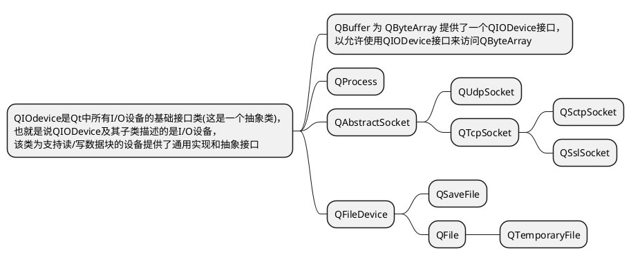

### 例子工程
  
&emsp;&emsp;当前目录下的**QT-IN-OUT**

### 类结构

&emsp;&emsp;QIODevice把设备分为两类 : 随机存储设备和顺序存储设备
1. 随机存储设备 : 可定位到任意位置(使用 seek()函数)，随机存储设备有QFile，QTemporaryFile，QBuffer
2. 顺序存储设备 : 不支持任意的位置存储，顺序存储设备有QProcess、QTcpSocket、 QUdpSocket 和 QSslSocket

&emsp;&emsp;还有四个独立的类

* QTextStream  用于对数据进行文本格式的读/写操作，可在**QString、QIODevice或QByteArray**上运行
* QDataStream  用于对数据进行二进制格式的读/写操作，**只可在QIODevice或QByteArray**上运行
* QTextCodec   负责Unicode与各字符编码之间的转换
* QByteArray

### QDataStream数据流
1. 字节序,即多字节数据(即大于一个字节的数据)在内存中的存储顺序，有如下两种方式。Little-Endian(LE，小端):即低位字节存储在低地址端,高位字节存储在高地址端。Big-Endian(BE,大端):即高位字节存储在低地址端,低位字节储倣在高地址端。

2. 对象的存储和传输 : 若直接把一个对象保存在文件(或其他地方)上是没有意义的, 因为对象中通常包含指向其他对象的指针，指针所指对象在下次运行时其内存地址很可能并不相同，因此在保存对象时，保存本次运行时指针的值就毫无意义，对此，需要采取必要的手
段来解决保存对象的问题。对象的传输同样会遇到这种问题(比如在客户端和服务端传递对象时，在进程间传递对象时)，解决这一问题的方法就是序列化(serializable)或称为串行化。
   **数据通常以二进制序列的形式进行传输，因此序列化通常是把对象转换为字节序列的过程，其相反过程称为反序列化。**

3. QDataStream是编码信息的二进制流,它完全独立于主机的**操作系统、CPU 和字节序，**比如由Windows编写的数据流可以由运行Solaris的Sun SPARC读取。还可使用数据流来读/写原始的未编码的二进制数据

4. QDataStream 支持的 Qt 类型有 QBrush、QColor、QDateTime、QFont、QPixmap、QString、QVariant 等类型，还包括容器类型，比如 QList、QVector、QSet、QMap 等，支持的Qt类型的完整列表可参阅帮助文档Serializing Qt Data Types

5. 使用QDataStream输入自定义类型时，需要重载<<和>>运算符，以使QDataStream支持新的数据类型。

### QTextStream文本流

&emsp;&emsp;二进制文件格式更紧凑，但它是机器语言，不易于人工阅读和编辑，为此可使用文本格式来代替二进制格式。
&emsp;&emsp;QTextStream能在**Unicode**编码与系统的**本地编码**或其他**任意编码**间进行转换，且明确的处理了因系统的不同而导致的不同的行尾符的问题(比如，在Windows上行尾符是"\r\n"，在UNIX或mac上是"\n")，行尾符还可在打开设备时指定
QIODevice::Text 枚举来设置。
&emsp;&emsp;QTextStream 使用QTextCodec类来支持不同的字符集，默认使用**QTextCodec::codecForLocale()**返回的编码进行读/写，也可使用**QTextStream::setCodec()**函数来重新设置编码。
&emsp;&emsp;QTextStream支持自动Unicode的BOM检测，当启用此功能(默认)时，QTextStream将检测UTF-16或UTF-32的字节顺序标记 BOM(Byte Order Mark)，并在读取时切换到适当的UTF编解码器。默认情况下，QTextStream不编写BOM，但是可以通过调用 **setGenerateByteOrderMark(True)**来启用BOM。

#### 额外的编码知识

##### 字符集和字符编码的概念

* **什么是字符集**:  是一个系统支持的所有抽象字符的集合。字符是各种文字和符号的总称，包括各国家文字、标点符号、图形符号、数
                 字等。也就是说一个集合里面都包含了什么文字和符合，比如ASCII字符集就是包含英文和一些符号，但是没有包含汉字。GB2312字符集只是包含了简体中文，但是没有包含繁体中文。所以字符集就是表示了一个包含范围。
   
* **什么是编码**:    是一个转换方法，这里主要是指人类的语言和计算机二进制的转换方法(计算机只认识二进制)，编码就是定义一个什
                 么样的二进制数对应某个字符。每个字符集都有对应的编码方式，比如ASCII编码使用一个8位的二进制数表示字符，当然只支持0000 0000 到 0111 1110 的二进制数。为什么后面 0111 1111 到 1111 1111的二进制数没有对应的字符，因为字符集只是包含了127个字符。

##### 遇到的问题

1. BIG5编码文件打开后有的文字会变成?  MinGw编译器也是这样
   
  
2. 如何查询本地的编码格式  
    windows cmd 使用chcp命令
    

   

