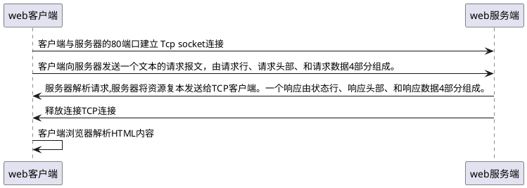
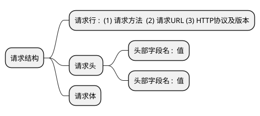
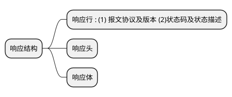

 ### http协议
&emsp;&emsp;HTTP协议采用了**请求/响应模型**。
&emsp;&emsp;客户端向服务器发送一个请求报文，请求报文包含**请求的方法、URL、协议版本、请求头部和请求数据**。
&emsp;&emsp;服务器以一个状态行作为响应，响应的内容包括**协议的版本、成功或者错误代码、服务器信息、响应头部和响应数据**。

#### http请求/响应步骤

#### http消息结构

##### http请求的结构

&emsp;&emsp;GET请求将数据存放在URL中，所以GET没有请求体
&emsp;&emsp;POST请求数据存放在请求体中，所以POST有请求体

##### http响应的结构

#### http请求方法

|序号|方法|描述|在哪个http版本出现|
|---|---|---|---|
|1 |GET|请求指定的页面信息，并返回实体主体。|HTTP 1.0|
|2 |HEAD |类似于 GET 请求，只不过返回的响应中没有具体的内容，用于获取报头|HTTP 1.0|
|3 |POST |向指定资源提交数据进行处理请求（例如提交表单或者上传文件）。数据被包含在请求体中。POST 请求可能会导致新的资源的建立和/或已有资源的修改。|HTTP 1.0|
|4 |PUT|从客户端向服务器传送的数据取代指定的文档的内容。|HTTP 1.1|
|5 |DELETE |请求服务器删除指定的页面。|HTTP 1.1|
|6 |CONNECT|HTTP/1.1 协议中预留给能够将连接改为管道方式的代理服务器。|HTTP 1.1|
|7 |OPTIONS|允许客户端查看服务器的性能|HTTP 1.1|
|8 |TRACE| 回显服务器收到的请求，主要用于测试或诊断。|HTTP 1.1|
|9 |PATCH |是对 PUT 方法的补充，用来对已知资源进行局部更新 。|HTTP 1.1|

### http 和 https的区别

&emsp;&emsp;HTTPS与HTTP的一些区别,HTTPS协议需要到CA申请证书，一般免费证书很少，需要交费。**HTTP协议运行在TCP之上，所有传输的内容都是明文**，**HTTPS运行在SSL/TLS之上，SSL/TLS运行在TCP之上，所有传输的内容都经过加密的。**
&emsp;&emsp;HTTP和HTTPS使用的是完全不同的连接方式，用的端口也不一样，**前者是80，后者是443**。
&emsp;&emsp;HTTPS可以有效的防止运营商劫持，解决了防劫持的一个大问题。

 

---

 

### 什么是webservice 
1. 基于web的程序，服务器端提供一些资源让客户端应用访问(获取数据)
2. 一种跨语言、跨平台的规范(抽象概念)
3. 多个跨平台、跨语言的应用间通信整合的方案(实际使用)

#### 什么时候使用webservice
1. 同一家公司的新旧应用之间
2. 不同公司的应用之间
3. 一些提供数据的内容聚合应用: 天气预报、股票行情...

#### webservice与http api的关系
&emsp;&emsp;WebService是个复杂规范，它的应用协议是SOAP（简单对象访问协议），它所依赖的下层通信方式不单单是HTTP，但是由于**HTTP协议群众基础广，开发调试方便，所以成了WebService中最为流行的方式。**

#### webservice中的重要术语
* WSDL(webservice 定义语言)，对应一种.wsdl文件，定义了服务端与客户端应用交互传递请求和响应数据的格式和方式，**一个webservice对应唯一一个wsdl文档**。
* SOAP(简单对象访问协议)，是一种简单的基于HTTP和XML的协议，用于在WEB上交换结构化的数据。soap消息分为请求消息和响应消息。
* SEI(webservice终端接口)，就是webservice服务器端用来处理请求的接口
* CXF(Celtix + XFire),一个appache的用于开发webservice服务器端和客户端的框架