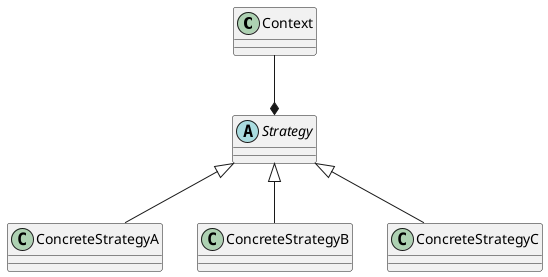
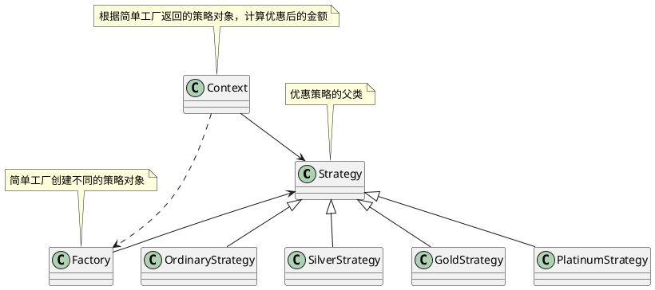

# 策略模式

## 什么是策略模式

&emsp;&emsp;定义一系列算法，把它们一个个封装起来，并且使它们可互相替换（**支持这些算法的变化**）。该模式使得算法可独立于使用它的客户程序(**稳定**)而变化（**扩展，子类化**）。——《设计模式》GoF

## 使用策略模式的动机

* 在软件构建过程中，某些对象使用的算法可能多种多样，经常改变，如果将这些算法都编码到对象中，将会使对象变得异常复杂；而且有时候支持不使用的算法也是一个性能负担。
* 如何在运行时根据需要透明地更改对象的算法？将算法与对象本身解耦，从而避免上述问题？   

&emsp;&emsp;在平时最常见的问题就是类中出现很多种情况的处理逻辑，导致了大量的if else 形式的代码存在，而策略模式可以很好的解决此问题。

&emsp;&emsp;这里我需要解释一下什么叫 **如果将这些算法都编码到对象中，将会使对象变得异常复杂；而且有时候支持不使用的算法也是一个性能负担**，比如有一个类是处理商品价格打折的，会根据不同的情况来处理打几折，如下代码。这样可以看出来，所有的处理逻辑都在这个类对象中了，也就是将算法都编写到了对象中，而且每次都是使用一个if分支，那么其他被装载到代码段的代码其实就没有被真正使用，会消耗过多CPU缓存。

```c
class A
{
    //省略其他元素

    void deal(int type)
    {
        if(type == 0)
        {
            //处理逻辑
        }
        else if(type == 1)
        {
            //处理逻辑
        }
    }
}
```

---

## 策略模式uml



&emsp;&emsp;strategy是一个抽象类，用于定义所有支持算法的公共接口，Context是一个上下文类，外界可以向内传入配置参数来决定使用哪个具体算法ConcreteStrategyX类，客户端直接使用Context对象。

> **上下文的解释1:** 上下文是包含了一些在处理过程中遇到的一些信息，可以把它看成一个类或一个进行的全局变量，它是公共合作的。类似于一篇文章，整个文章可以叫上下文，是因可以从中获得所有可用到的信息。比如spring的上下文，你可以从中获取Sping的一些配置文件。比如你在java开发中，在父类中定义了一个map存储一些基本信息，那么在子类的继承中，你可以从中获得这些信息，那么这个map就可以理解为上下文.

> **上下文的解释2:** 
> 一句话讲清 就像一篇文章一样,在上文中作者为了表述方便,不重复使用一个名词:阿尔巴士托福自检测公式,将这个名词简称为 阿尔公式。在下文中如果引用到了阿尔公式，那么就是指阿尔巴士托福自检测公式。上文配置，下文引用，这就是上下文。

---

## 策略模式和工厂模式的区别

&emsp;&emsp;这两者从代码形式上看都是继承抽象类，然后在运行时去选择使用哪个子类，而然需要注意的是，工厂模式子类的内容都是**new对象**,策略模式的子类都是一些**业务上的处理算法**，所以前者是解决选择创建对象的问题，后者是解决选择程序行为的问题。

---

## 代码演示

&emsp;&emsp;此次演示的故事背景是根据不同会员等级来进行商品价格打折，有普通会员、白银会员、黄金会员、白金会员。在实现方式上有策略模式+简单工厂模式，策略模式+工厂模式两种。

### 公共代码部分

```c
    //策略模式  这是两种方式公共使用的部分
    enum
    {
        E_ONE,E_TWO,E_THREE,E_FOUR
    };

    //策略抽象类
    class Strategy
    {
    public:
        virtual double computer(int money) = 0;
        virtual ~Strategy(){}
    };

    // 普通会员策略
    class OrdinaryStrategy : public Strategy
    {
        virtual double computer(int money)
        {
            qDebug("普通会员 不打折");
            return money;
        }
    };

    // 白银会员策略
    class SilverStrategy : public Strategy
    {
        virtual double computer(int money)
        {
            qDebug("白银会员 优惠50元");
            return money - 50;
        }
    };

    // 黄金会员策略
    class GoldStrategy : public Strategy
    {
    virtual double computer(int money)
    {
            qDebug("黄金会员 8折");
            return money * 0.8;
    }
    };

    // 白金会员策略
    class PlatinumStrategy : public Strategy
    {
    virtual double computer(int money)
    {
            qDebug("白金会员 优惠50元，再打7折");
            return (money - 50) * 0.7;
    }
    };
```

### 策略模式+简单工厂 UML



### 策略模式+简单工厂 代码

```c
    class Factory
    {
        private:
            map<int, Strategy * > m;
        public:
            Factory()
            {
                m[E_ONE] = new SilverStrategy();
                m[E_TWO] = new GoldStrategy();
                m[E_THREE] = new PlatinumStrategy();
                m[E_FOUR]  = new OrdinaryStrategy();
            }

            Strategy * getEatStrategy()
            {
                return m[type];
            }
            int type;
    };

    //策略上下文类
    class Context
    {
        private:
            Strategy * pStrategy;

        public:
            Context(Factory _pFactory)
            {
                this->pStrategy = _pFactory.getEatStrategy();
            }

            void getResult(int money)
            {
                pStrategy->computer(money);
            }
    };

    int main()
    {
        Factory f;
        f.type = E_THREE;

        Context con(f);
        con.getResult(1000);
    }
```

### 策略模式+工厂 UML

```plantuml
abstract class AbFactory{}
note top of AbFactory: 工厂类
class SilverFactory{}
class GoldFactory{}
class PlatinumFactory{}
class OrdinaryFactory{}

AbFactory <|--  SilverFactory
AbFactory <|--  GoldFactory
AbFactory <|-- PlatinumFactory
AbFactory <|-- OrdinaryFactory


class Strategy{}
note bottom of Strategy: 策略类
class OrdinaryStrategy{}
class SilverStrategy {}
class GoldStrategy {}
class PlatinumStrategy{}

Strategy <|--  OrdinaryStrategy
Strategy <|--  SilverStrategy
Strategy <|--  GoldStrategy
Strategy <|--  PlatinumStrategy


SilverStrategy   <.. SilverFactory
GoldStrategy     <.. GoldFactory
PlatinumStrategy <.. PlatinumFactory
OrdinaryStrategy <.. OrdinaryFactory


class Context2{}

Context2 ..>  AbFactory 
Context2 -->  Strategy
```


### 策略模式+工厂模式 代码

```c
        //工厂类
        class AbFactory
        {
        public:
            virtual Strategy * CreateStrategy() = 0;
            virtual ~AbFactory(){}
        };


        //白银工厂
        class SilverFactory: public AbFactory
        {
        public:
                Strategy * CreateStrategy() { return new SilverStrategy; }
        };

        //黄金工厂
        class GoldFactory: public AbFactory
        {
        public:
                Strategy * CreateStrategy() { return new GoldStrategy; }
        };

        //白金工厂
        class PlatinumFactory: public AbFactory
        {
        public:
                Strategy * CreateStrategy() { return new PlatinumStrategy; }
        };

        //普通工厂
        class OrdinaryFactory: public AbFactory
        {
        public:
                Strategy * CreateStrategy() { return new OrdinaryStrategy; }
        };


        //策略上下文类
        class Context2
        {
        private:
            Strategy * pStrategy;

        public:
            Context2(AbFactory * _pFactory)
            {
                this->pStrategy = _pFactory->CreateStrategy();
            }

            void getResult(int money)
            {
                pStrategy->computer(money);
            }
        };

        int main()
        {
            //前期准备 
            map<int,AbFactory *> mm;
            mm[E_ONE]   = new SilverFactory();
            mm[E_TWO]   = new GoldFactory();
            mm[E_THREE] = new PlatinumFactory();
            mm[E_FOUR]  = new OrdinaryFactory();

            //使用
            Context2  con2(mm[E_TWO]);
            con2.getResult(100);
        }
```

&emsp;&emsp;**客户端直接使用的是策略上下文类Context2** ，在这个类中完全的剔除了编码依赖关系(**没有了具体的类，只有抽象类**)。但是这种编码依赖关系不会被完全的从代码中删除，我们只是将实现具体类型的代码集中到了一起(**就像把猫关进笼子，方便增删**)，而业务代码是没有了编码依赖关系。在这个例子中工厂模式起到了将编码依赖关系关进笼子的效果，而在Context类中只需要获取Strategy类的指针再执行->computer(xxx)方法就行了。  

&emsp;&emsp;在学习的过程中，我还想到了一点，那就是**程序对客户端选择的依赖**。现在对象创建好了，算法也都准备好了，但是程序总是要知道应该用哪个吧?其实这个时候能想到if else是很正常的，客户端通常是传递给程序一个标志参数(**枚举 int 或者 字符串**)，然后程序经过判断知道要创建谁要用谁，其实if else 就是起到了一个映射的效果。但是我没有用，而是用到map数据结构来替代映射关系。  

&emsp;&emsp;再次比较两种实现的方法，就会发现简单工厂模式将依赖客户端选择的逻辑放到了自己类的内部。工厂模式将这一部分放到了外部完全剔除了对客户端选择的依赖，而这一部分映射关系代码放到哪里去实现就不是工厂类关心的了。


## 实际例子

&emsp;&emsp;整个界面上只有算法参数配置界面是更改最多的，不同的算法类型需要不同的配置参数(也有重叠的部分，但是整体上依旧是有差别)。曾经的做法是一个算法对应一个配置界面，多一个算法规则就会多一个配置界面，就会多一个界面类，那就会多增加三个文件(.cpp  .h  .ui)。前期这种做法确实很高效，但是随着时间的流失，现在算法规则已经增加到了30个左右，问题也愈加的凸显出来。

1. 每增加一个算法规则，那么配置参数界面就要新增一个，而这30多个算法配置界面的运行逻辑和代码结构几乎相同，有时配置界面的控件都是90%相同的，所以开发一个算法配置界面基本就是找一个旧的算法配置界面copy一下然后再改改，十分枯燥。  
   
2. 30多个算法配置界面就基本相当于一个算配置界面的30个分身，由于运行逻辑相同，所以改一个算法配置文件(比如界面控件的效果、源文件中逻辑判断)，那么其他配置都要手动修改，以保证界面使用效果相同，想想就恐怖

&emsp;&emsp;现在要认真的想想这个问题了，这么一团臃肿的东西，怎么能修改的苗条一些。问题的重点在于，不同的算法规则要对应不同的算法配置界面类(.cpp .h .ui),算法配置界面类不能一直增加，否则就控制不住，无论显示什么控件，都在这一个类里完成，就像一个电视可以播放多个频道一样。原有的算法配置界面都拆开成一个个的基础控件，这些控件就像"字母“一样，组装成不同的"单词"(算法配置界面)，基础控件不会无限制的增加，有十几个常用的就够了。修改一个基础控件类，那么所有用到这个控件的地方就都改了，大大提高了修改速度，减少了修改范围。那么算法配置界面类只需要做以下几件事。

1. 搭建好界面布局 
2. 确定要展示的算法界面以及要使用的控件
3. 向界面布局中填入控件完成展示。

&emsp;&emsp;现在来看看算法配置界面类，这里用A来表示类对象，A对象在被调用时需要知道显示哪个算法规则的界面，常规思路就是if else，那么外界传来一个枚举值M(表示展示哪个算法界面)，A的内部就需要去用if else来判断，M==1就是展示算法规则1的界面，M==2就是展示算法规则2的界面，这个if else中对应的就是上面所述的第二步和第三步。如下，

```c
        if(M==1){
                    创建算法规则1需要的控件;
                    将控件摆放到对应的布局中;   //不同的算法规则界面中同一个控件的摆放位置可能不同，所以第三步也放到里面
        }else if(M==2){
                    创建算法规则1需要的控件;
                    将控件摆放到对应的布局中;
        }else if{
            //...
        }
```
&emsp;&emsp;从上面伪代码中，还是能感觉到臃肿，比如一个界面需要5个控件组成，那么30个if就要写150个控件的创建，更可气的是有两个if中控件用的都相同，但是就是位置不同，但是大家都会这么想，都用if else写了，多写一个也无所谓了，很快这个if else又会变得无法控制。而且if中创建的控件都要以成员变量(大部分情况是指针)的形式存在A类中，每个控件指针变量的个数是多少这也不确定，那这样每个控件指针是不是要存储到对应的vector中，需要多少就放多少个，想想就觉得不对劲。

&emsp;&emsp;如果A类是具象类，那么可能就得像上面的写法，所有需要的元素都得在类中存放，所以转变思想将A类转变抽象类变成抽象算法配置界面类，算法1配置界面、算法2配置界面都继承A类，很明显这种创建具体类的方法有点像工厂模式。现在需要创建的有控件和具体的算法配置界面，控件是在配置界面中创建的，所以不用考虑控件，配置界面类像产品类，只有这一种产品，所以用简单工厂就足够了。这样每个具体配置界面类中只需要创建自己需要的控件并填充界面布局即可，而且控件指针变量的个数也是可控的。而客户只需要向简单工厂中传入枚举值即可，那么简单工厂内部逻辑如下

```c
        if(M == 1){
            创建算法1配置界面类对象
        }else if(M == 2){
            创建算法2配置界面类对象
        }
```

&emsp;&emsp;又是熟悉的if else，不过还算有进步，每个if中只是创建一个算法配置界面对象并向外返回这个对象。其实这里也可以在简单工厂中将所有的具体类对象都创建出来存到map<枚举值，配置界面对象指针>里面，外界用哪个就返回哪个。继续想，如果客户调用前已经传递参数说我只用1-10配置界面中的2，5，7，那么将所有的配置界面对象创建出来会造成空间的浪费，不想浪费那就还得在简单工厂中使用if else创建，这其实还是把业务代码(我认为if else这一块是和业务相关的)带进来了。如果要把if else部分完全从工厂部分的代码中剔除，可以采用工厂+策略模式，虽然开始写觉得框架里面的东西很少，但是扩展性很好，后期只需要增加具体的配置界面类以及对应的具体的工厂就行了。